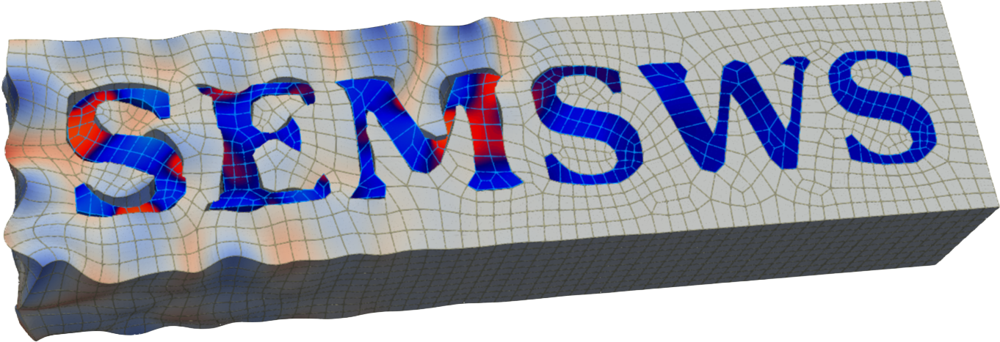

<p align="center">
  
</p>

<p align="center">
  <a href="LICENSE"></a>
  <a href="https://isocpp.org/"></a>
  <a href="https://mfem.org/"></a>
</p>

---

## Overview

**SEMSWS** (Spectral Element Method — Seismic Wave Simulator) is a
high-performance seismic wave propagation solver written in C++17 and built
on [MFEM](https://mfem.org/).

- **Parallel** MPI domain decomposition for HPC clusters
- **Portable GPU** support (CUDA / HIP) through MFEM's device layer
- **Multiple physics**: isotropic acoustic, isotropic elastic, and
  viscoelastic (generalized Maxwell body) wave equations in 2D/3D

## 概要

**SEMSWS**(Spectral Element Method — Seismic Wave Simulator)は、C++17 と
[MFEM](https://mfem.org/) を基盤とする高性能な地震波伝播ソルバです。

- **並列化**: MPI によるドメイン分割で HPC クラスタにスケール
- **GPU 対応**: MFEM のデバイス抽象化層を通じて CUDA / HIP に対応
- **複数の物理**: 等方音響、等方弾性、粘弾性(一般化 Maxwell)の 2D/3D

---

## Repository layout

```
src/                     C++ sources (simulation, operators, materials, integrators)
include/                 C++ headers (mirrors src/)
cmake/                   CMake helpers
driver/                  Python driver (semsws_driver) for shot orchestration
test/                    pytest suite (unit, consistency, waveform, coupling)
scripts/plot/            Python helpers for wavefield / mesh visualization
examples/visualization/  Wavefield / kernel rendering examples
assets/                  Logos
spack-repo/              Spack package recipe + LUMI / Earth Simulator site-config
```

---

## Third-party components

SEMSWS depends on the following projects. See each project for its own license:

- [MFEM](https://mfem.org/) — finite element library (BSD-3)
- [ADIOS2](https://github.com/ornladios/ADIOS2) — parallel I/O (Apache 2.0)
- [yaml-cpp](https://github.com/jbeder/yaml-cpp) — YAML parser (MIT)
- [HDF5](https://www.hdfgroup.org/solutions/hdf5/) — hierarchical data format (BSD-3)

## Documentation

Full installation and usage documentation is distributed as a separate PDF
manual. A copy will be included in this repository once released.

詳細なインストール・使用方法は別途 PDF マニュアルとして提供されます。
公開後、本リポジトリにも同梱予定です。

## License

SEMSWS is released under the [BSD 3-Clause License](LICENSE), the same
license used by [MFEM](https://github.com/mfem/mfem).
